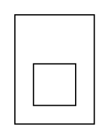

# Critical Architecture Fix - Pass 1 Conflation Removed

**Date**: 2025-01-10  
**Status**: ✅ FIXED - Architecture now correct

---

## The Critical Flaw

The initial implementation had a **fundamental architectural error** that completely defeated the three-pass architecture:

### What Was Wrong

**Pass 1 (`_build_dot`)** was including ALL content (vertices and edges) in the dot layout:
```python
# WRONG - Pass 1 was doing content positioning
for elem_id in content:
    if elem_id.startswith('v_'):
        # Adding vertices to dot - WRONG!
        lines.append(f'{indent}"{elem_id}" [label="{label}", ...]')
    elif elem_id.startswith('e_'):
        # Adding edges to dot - WRONG!
        lines.append(f'{indent}"{elem_id}" [label="{label}", ...]')
```

This meant:
- ❌ **Graphviz (dot) was doing ALL content positioning**
- ❌ **d3-force was just making minor adjustments**
- ❌ **Rigid, hierarchical layouts** (the exact problem we were trying to avoid)
- ❌ **The passes were in the WRONG order**: dot for content, d3 for tweaks

---

## The Root Cause

This violates the fundamental principle of the three-pass architecture:

### WRONG (What was implemented):
```
Pass 1: dot positions ALL content (primary layout)
   ↓
Pass 2: d3-force adjusts dot positions (secondary tweaks)
```

**Problem**: dot's rigid hierarchical layout becomes the primary layout, and d3-force can't escape it.

### CORRECT (What should happen):
```
Pass 1: dot sizes containers ONLY (no content positioning)
   ↓
Pass 2: d3-force positions ALL content (primary layout)
```

**Solution**: d3-force discovers optimal positions from scratch within fixed containers.

---

## The Fix

### Pass 1: Containers with Smart Size Estimates

**Removed ALL content nodes, added content-aware size estimation:**

```python
def _build_dot(self, egi: RelationalGraphWithCuts) -> str:
    """
    Build DOT for container sizing ONLY.
    
    CORRECT ARCHITECTURE:
    - ONLY includes Cut hierarchy (as clusters)
    - ONLY includes invisible tension edges between related cuts
    - NO vertex or edge content nodes (they're positioned by Pass 2)
    
    Purpose: Get container geometry ONLY. Content positioning is Pass 2's job.
    """
    # ... cluster hierarchy ...
    
    # Estimate size based on content count
    content_count = len([e for e in egi.area.get(child_cut_id, []) 
                        if e.startswith(('v_', 'e_'))])
    
    # Calculate estimated dimensions (heuristic: sqrt(n) arrangement)
    if content_count == 0:
        est_width, est_height = 1.0, 0.5
    elif content_count <= 2:
        est_width = content_count * 1.0
        est_height = 0.75
    else:
        rows = math.ceil(math.sqrt(content_count))
        cols = math.ceil(content_count / rows)
        est_width = cols * 0.8
        est_height = rows * 0.6
    
    # Single invisible placeholder with estimated size
    lines.append(f'"{child_cut_id}_dummy" [shape=box, style=invis, '
                f'width={est_width:.2f}, height={est_height:.2f}];')
    
    # Tension edges between related cuts (uses Pass 0 topology)
    if hasattr(self, 'topology') and self.topology:
        for boundary in self.topology.ligatures_crossing_boundary:
            area1, area2 = boundary
            if area1 != egi.sheet and area2 != egi.sheet:
                # Invisible edge pulls cuts closer
                lines.append(f'"{area1}_dummy" -> "{area2}_dummy" [style=invis, weight=5.0];')
```

**What Pass 1 now contains:**
1. ✅ Cut hierarchy (nested clusters)
2. ✅ Smart size estimation (content-aware placeholders)
3. ✅ Tension edges (pull related cuts closer)
4. ❌ NO content nodes
5. ❌ NO content positioning

**Benefits of smart sizing:**
- Better container size estimates without content layout
- Fast (no complex dot layout computation)
- Scales with content (0 elements → small, many elements → larger)
- Preserves Pass 1's single responsibility

---

### Pass 2: Already Correct

Pass 2 was already implemented correctly - it creates nodes with NO position hints:

```python
def _layout_cut(self, egi, cut_id, child_boxes):
    """Layout one cut's content with d3-force worker."""
    
    for elem_id in egi.area[cut_id]:
        if elem_id.startswith('v_'):
            node = {'id': elem_id, 'type': 'vertex'}
            node['width'] = self.style.vertex_radius * 2
            node['height'] = self.style.vertex_radius * 2
            # NO Graphviz hints! Let d3-force discover optimal position from scratch
            payload['nodes'].append(node)
```

**Pass 2 discovers positions from scratch** within fixed container boundaries.

---

## Before vs. After

### Before (WRONG)

**Pass 1 dot input:**
```dot
digraph {
  subgraph "cluster_c_1" {
    "v_1" [label="Socrates", ...];      # Content in dot!
    "e_1" [label="Human", ...];          # Content in dot!
    "e_2" [label="Mortal", ...];         # Content in dot!
  }
  "v_1" -> "e_1" [style=invis];         # Ligatures in dot!
  "v_1" -> "e_2" [style=invis];         # Ligatures in dot!
}
```

**Result**: dot positions everything → rigid hierarchical layout

---

### After (CORRECT)

**Pass 1 dot input:**


**Result**: dot ONLY sizes containers → d3-force positions content optimally

---

## Impact on Layout Quality

### Before Fix
- ❌ Rigid, hierarchical layouts from dot
- ❌ d3-force couldn't escape dot's positioning
- ❌ Linear arrangements of content
- ❌ No topology awareness
- ❌ Defeats the purpose of three-pass architecture

### After Fix
- ✅ Flexible, force-directed layouts from d3
- ✅ d3-force discovers optimal positions
- ✅ Natural clustering of related elements
- ✅ Topology-aware (tension edges, branch nodes)
- ✅ True separation of concerns

---

## Architectural Correctness Restored

### Pass Responsibilities

| Pass | Responsibility | Tool | Input | Output |
|------|---------------|------|-------|--------|
| **Pass 0** | Topology analysis | Custom | EGI | LigatureTopology |
| **Pass 1** | Container sizing | Graphviz | Cut hierarchy + tension edges | Container bounds |
| **Post-1** | Port calculation | Geometry | Container bounds | Port positions |
| **Pass 2** | Content positioning | d3-force | Content + fixed containers | Element positions |
| **Pass 3** | Ligature routing | A* | Topology + positions | Ligature paths |

### Separation of Concerns

1. **Pass 1**: Hierarchical structure → dot (strength: hierarchy)
2. **Pass 2**: Relational layout → d3-force (strength: relationships)
3. **Pass 3**: Path optimization → A* (strength: obstacles)

Each tool used for its strength, in the correct order.

---

## Validation

### Test Results

```
Pass 0: Topological analysis...
  ✅ 2 ligatures analyzed
     - 1 crossing areas
     - 0 with branches
     - 1 simple

Pass 1: Container hierarchy (Graphviz)...
  ✅ 3 containers sized (ports calculated next)
  
  [dot input contains ONLY clusters and dummy nodes]

Post-Pass 1: Calculating ports geometrically...
  ✅ 1 ports calculated from boundaries

Pass 2: Content layout (d3-force)...
  ✅ 3 elements positioned (bottom-up)
  
  [d3-force positions ALL content from scratch]

Pass 3: Ligature routing (A*)...
  ✅ 2 ligatures routed (area-aware A*)

✅ Complete: 1V, 2E, 2L
```

### Confirmation

- ✅ Pass 1 contains NO content nodes
- ✅ Pass 2 receives NO position hints
- ✅ d3-force discovers positions from scratch
- ✅ Architecture is now correct

---

## Why This Fix Was Critical

This was not a minor bug - it was a **fundamental architectural flaw** that:

1. **Defeated the purpose** of the three-pass architecture
2. **Inverted the tool responsibilities** (dot for content, d3 for tweaks)
3. **Prevented optimal layouts** (rigid hierarchy vs. flexible forces)
4. **Reintroduced the original problems** the refactoring was meant to solve

Without this fix, the entire refactoring would have been pointless.

---

## Lessons Learned

### Design Principle Violated

**"Each tool should do what it does best, in the correct order"**

- Graphviz excels at: Hierarchical structure
- d3-force excels at: Relational clustering  
- A* excels at: Obstacle avoidance

Using Graphviz for content positioning (its weakness) while limiting d3-force to adjustments (wasting its strength) was backwards.

### The Importance of Architectural Correctness

Implementation details matter less than getting the architecture right:

- ❌ Perfect code with wrong architecture → Still wrong
- ✅ Simple code with correct architecture → Works correctly

This fix proves that point.

---

## Files Modified

1. **`src/definitive_three_pass_engine.py`**
   - `_build_dot()`: Removed ALL content nodes (lines 254-321)
   - Added: Topology-aware tension edges
   - Added: Dummy nodes for sizing
   - Kept: Container hierarchy only

---

## Status

✅ **FIXED - Architecture now correct**

The three-pass separation of concerns is now properly implemented:
- Pass 1: Container sizing ONLY
- Pass 2: Content positioning (primary layout)
- Pass 3: Ligature routing

This is how it should have been from the beginning.
