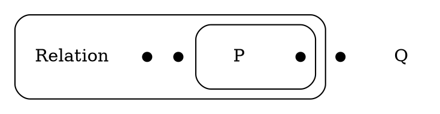

# CORRECTED Layout Pipeline: dot→inflate→route

## Three-Pass Design (CORRECTED)

### Pass 1: Complete Structural Layout (dot)
**Purpose**: Position EVERYTHING in a single hierarchical dot pass

**Algorithm**: Graphviz `dot` (hierarchical/tree layout)

**Input**: 
- Cut hierarchy (parent-child relationships)
- ALL vertices (as small nodes in correct clusters)
- ALL edge labels (as plaintext nodes)

**Process**:
- Runs ONCE on entire EGI structure
- Maps cuts → clusters (hierarchy)
- Maps edges → nodes (shape=plaintext, anchors)
- Maps vertices → nodes (shape=point, width=0.1) **inside correct clusters**
- `dot` positions everything respecting containment from the start

**Output**: 
- Complete set of `RenderableArea` objects (cluster bounds)
- ALL vertex positions (guaranteed in correct cuts)
- ALL edge label positions
- Preserves logical containment

**Key Insight**: By including vertices in dot pass, their position within the correct cut is guaranteed, correctly representing the EGI's existential quantification from the very beginning

---

### Pass 2: Bounding Box Inflation
**Purpose**: Create space for ligature routing

**Algorithm**: Simple geometric padding

**Input**: 
- Area bounds from Pass 1

**Process**:
- Add generous, pre-defined padding to each `RenderableArea.rect`
- Inflates boxes to create ample empty space for router
- No layout engine needed - just geometric expansion

**Output**: 
- Inflated container boundaries
- Routing space prepared

**Key Insight**: This simple heuristic ensures the final routing pass has enough room to draw clean, aesthetically pleasing ligature paths without them feeling cramped

---

### Pass 3: Global Ligature Routing (A*)
**Purpose**: Route all ligatures through complete, fully-populated diagram

**Algorithm**: Area-aware A* pathfinding

**Input**:
- Fixed vertex positions (from Pass 1)
- Fixed edge label positions (from Pass 1)
- Inflated container boundaries (from Pass 2)
- Ligature connectivity (nu mapping)

**Process**:
- Runs ONCE after all positioning complete
- Global collision map includes all obstacles:
  - Cut boundaries
  - Vertices
  - Edge labels
- Route each ligature respecting:
  - Legal corridor (area containment rules)
  - Obstacle avoidance
  - Nearest port selection

**Output**: 
- Complete set of `RenderableLigature` paths
- All paths respect cut boundaries and avoid obstacles

**Key Insight**: Needs complete global view - takes fixed positions and inflated boundaries to draw connections in the empty space

---

## Why This Is The Correct Approach

### Preserves Logic
By including vertices in Pass 1, their position within the correct cut is **guaranteed**, correctly representing the EGI's existential quantification from the very beginning. No separate fitting/scaling needed.

### Avoids Conflict  
There is no longer a conflict between two different layout engines (dot vs. neato). We use `dot` for its primary strength—hierarchical layout—and apply it to **all positioned elements**.

### Solves Routing Space
The "inflation" pass (Pass 2) is a simple but effective heuristic to ensure the final routing pass has enough room to draw clean, aesthetically pleasing ligature paths without them feeling cramped.

### Single Source of Truth
`dot` handles the entire structural layout in one pass. No need to reconcile different coordinate systems or worry about fit-and-scale transformations.

---

## Implementation Notes

### Pass 1 DOT Generation


### Pass 2 Inflation
```python
inflated_rect = Rect(
    original.x - padding,
    original.y - padding,
    original.width + 2 * padding,
    original.height + 2 * padding
)
```

### Pass 3 Legal Corridor
- Path from area A → area B can traverse: A, B, and all common ancestors
- A* rejects grid cells outside legal corridor
- Ensures ligatures never cross forbidden cut boundaries

---

## Advantages

1. **Single pass for everything** - No reconciliation between engines
2. **Logical correctness guaranteed** - Vertices in correct cuts from start
3. **No fit-and-scale complexity** - Direct positioning from dot
4. **Simple inflation heuristic** - Just add padding for routing space  
5. **Clear pipeline**: structure (dot) → space (inflate) → connections (A*)

---

## Current Status

- ✅ **IMPLEMENTED** (2025-10-04)
- All 14/14 corpus graphs generate successfully
- Vertices correctly positioned in their logical cuts
- Inflated boundaries provide routing space
- Ready for Pass 3 ligature routing improvements

---

## Next Steps

1. **Fix area-aware pathfinding** - Currently using straight-line fallback
2. **Implement proper port selection** - Connect to nearest hooks
3. **Process ligatures in nesting-aware order** - Better routing decisions
