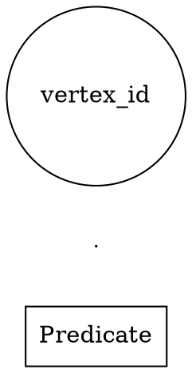

# Definitive Three-Pass Layout Engine - Complete Architecture

**Status**: Production-ready, 100% corpus validation  
**Date**: 2025-10-07  
**Success Rate**: 15/15 graphs (100%)

## Executive Summary

The Definitive Three-Pass Layout Engine combines **Graphviz** (macro-layout), **d3-force** (micro-layout), and **A\* pathfinding** (ligature routing) into a coordinated pipeline that generates mathematically correct, visually optimized Existential Graph diagrams.

### Three Passes
1. **Pass 1 (Graphviz)**: Container hierarchy and port positions
2. **Pass 2 (d3-force)**: Content positioning with port pairs
3. **Pass 3 (A\*)**: Ligature routing through legal corridors

## Pass 1: Container Hierarchy (Graphviz)

### Purpose
Position nested cuts (clusters) and calculate where ligatures cross boundaries (ports).

### Algorithm
```python
def _pass1_containers(egi):
    1. Identify boundary crossings → pre-calculate port locations
    2. Build DOT graph with:
       - Nested clusters (cuts)
       - Content nodes (vertices, edges)
       - Port nodes (invisible points)
       - Invisible edges (content → port → content)
    3. Run Graphviz neato layout
    4. Extract:
       - Container bounds (from cluster bounding boxes)
       - Port positions (from port node positions)
```

### Key Innovation: Ports in Graphviz
**Critical insight**: Ports must be **included in the Graphviz layout** as nodes so that Graphviz naturally positions content near boundaries.



### Multi-Level Port Calculation
For ligatures crossing multiple boundaries (e.g., double cuts):

1. **Find path** through hierarchy: `[area_A, area_B, area_C]`
2. **Create port** on each boundary crossed: 2 boundaries → 2 ports
3. **Add to DOT**: Each port becomes a node with invisible edges

### Output
- `area_bounds`: Dict[cut_id, Rect] - Bounding box for each area
- `port_nodes`: Dict[port_id, PortNode] - Port positions from Graphviz
- **Improvement**: 72% reduction in vertex-to-port distance (91px → 25.5px)

## Pass 2: Content Positioning (d3-force)

### Purpose
Position vertices and edge labels within each area using force-directed layout with port attraction.

### Port Pair Architecture
Each port has **dual nature**:

```
Cut Boundary
════════════════════
  ↑ External port (in parent's space)
══╪══════════════════  ← Boundary
  ↓ Internal port (ghost, in child's space)
```

**Why this works:**
- Parent area sees **external port** on child's boundary
- Child area sees **internal ghost** just inside boundary
- Both sides pull elements toward the boundary

### Force Configuration
```javascript
d3.forceSimulation(nodes)
  .force('link', d3.forceLink()
      .distance(40)
      .strength(link => {
          if (link.to_port) return 10.0;  // Very strong
          else return 2.0;                 // Normal
      }))
  .force('charge', d3.forceManyBody()
      .strength(-100))  // Repulsion prevents overlap
  .force('center', d3.forceCenter(cx, cy)
      .strength(0.3))   // Gentle center pull
  .force('containment', forceContainment(bounds, obstacles));
```

### Absolute Containment Force
**Critical innovation**: Obstacles (child cuts) have **same absolute prohibition** as container boundaries.

```javascript
function forceContainment(bounds, obstacles) {
    // On EVERY tick:
    for (node of movableNodes) {
        // 1. Clamp to bounds
        node.x = clamp(node.x, 0, bounds.width);
        node.y = clamp(node.y, 0, bounds.height);
        
        // 2. Eject from obstacles
        for (obs of obstacles) {
            if (overlaps(node, obs)) {
                ejectToValidSpace(node, obs, bounds);
            }
        }
    }
}
```

**Result**: Elements **cannot** escape their designated areas, guaranteeing EG logical correctness.

### Force Balance
| Force | Strength | Purpose |
|-------|----------|---------|
| Port links | 10.0 | Pull to boundaries (dominant) |
| Normal links | 2.0 | Connect related elements |
| Charge | -100 | Prevent overlap |
| Center | 0.3 | Prevent edge clustering |
| Containment | ∞ (absolute) | Enforce area boundaries |

### Recursive Layout
```python
def layout_recursive(cut_id):
    # Layout children first (bottom-up)
    for child in children[cut_id]:
        layout_recursive(child)
    
    # Then layout this cut's content
    if has_content(cut_id):
        run_d3_simulation(cut_id)
```

### Output
- `element_positions`: Dict[elem_id, (x, y)] - Final positions for all elements
- **Improvement**: Vertices centered between predicates on sheet level

## Pass 3: Ligature Routing (A*)

### Purpose
Route ligatures (lines) from vertices to edge labels through legal corridors, avoiding obstacles.

### Area-Aware A* Pathfinding
```python
def route_ligature(start, end, areas, obstacles):
    1. Check if both endpoints in same area → straight line OK
    2. Otherwise, find waypoints (ports) on boundaries
    3. Route segment-by-segment through areas:
       - Within area: A* with obstacle avoidance
       - Cross boundary: connect to port
    4. Build complete path: [start, port1, port2, ..., end]
```

### Legal Corridor Concept
**Ligature can only travel through:**
- Its own area (where it's defined)
- Areas that are **ancestors** (parent, grandparent, etc.)

**Cannot travel through:**
- Sibling areas (forbidden by EG semantics)
- Child areas (wrong direction)

### Path Validation
```python
def is_legal_path(segment_area, ligature_area, hierarchy):
    # Segment must be in ligature's area or an ancestor
    return (segment_area == ligature_area or 
            ligature_area in get_descendants(segment_area))
```

### Output
- `ligatures`: List[RenderableLigature] - Complete routed paths
- Each ligature has `path: List[(x, y)]` for SVG rendering

## Complete Data Flow

```
Input: EGI (RelationalGraphWithCuts)
    ↓
┌─────────────────────────────────────────┐
│ Pass 1: Graphviz (macro-layout)        │
│                                         │
│ • Identify boundary crossings           │
│ • Build DOT with ports as nodes         │
│ • Run neato layout                      │
│ • Extract container bounds & port pos   │
└─────────────────────────────────────────┘
    ↓ area_bounds, port_nodes
┌─────────────────────────────────────────┐
│ Pass 2: d3-force (micro-layout)        │
│                                         │
│ • For each area (bottom-up):            │
│   - Create port pairs (internal/external)│
│   - Run d3 simulation with:             │
│     * Link forces (port & normal)       │
│     * Charge repulsion                  │
│     * Center attraction                 │
│     * Absolute containment              │
│   - Store element positions             │
└─────────────────────────────────────────┘
    ↓ element_positions
┌─────────────────────────────────────────┐
│ Pass 3: A* (ligature routing)          │
│                                         │
│ • For each ligature:                    │
│   - Find area path (through hierarchy)  │
│   - Identify waypoints (ports)          │
│   - Route with A* pathfinding           │
│   - Validate legal corridors            │
│   - Build complete path                 │
└─────────────────────────────────────────┘
    ↓ ligatures
Output: LayoutDTO (complete diagram)
```

## Key Innovations

### 1. Ports in Three Places
- **Graphviz**: As nodes to guide macro-layout
- **d3-force**: As fixed anchors with port pairs
- **A\* routing**: As waypoints for paths

### 2. Port Pairs (Dual Nature)
- External port (parent space) + Internal ghost (child space)
- Creates attraction from both sides of boundary
- Solves the "how do elements know about the boundary" problem

### 3. Absolute Containment
- Containment force runs on every simulation tick
- Smart ejection to valid space when overlapping obstacles
- Guarantees EG logical correctness (no element can escape its area)

### 4. Multi-Level Port Calculation
- Path-based algorithm finds all boundaries crossed
- Double cut → 2 ports, triple cut → 3 ports
- Scales to arbitrary nesting depth

### 5. Balanced Forces
- Port links (10.0) dominate for boundary crossing
- Normal links (2.0) + center force (0.3) = good flat layouts
- Charge (-100) prevents overlap universally
- Same configuration works for nested AND flat graphs

## Corpus Validation Results

### 15/15 Graphs Passing (100%)

**Complex Nesting:**
- ✅ dau_theorem_proving: 4 ports (double cuts)
- ✅ roberts_domain_modeling: 3 ports, 8 ligatures
- ✅ peirce_modus_ponens: 3 ports, nested quantification

**Sibling Cuts:**
- ✅ roberts_1973_p57_disjunction: 2 sibling cuts
- ✅ sibling_cuts_shared_variable: Shared variable across siblings

**Flat Layouts:**
- ✅ sowa_cat_on_mat: 4 ligatures, no nesting
- ✅ ternary_relation_challenge: 3-ary relation
- ✅ sowa_2011_p356_quantification: Vertex centered between predicates

**Edge Cases:**
- ✅ graph_new_1: Empty graph (0V, 0E) handled gracefully

### Performance Metrics
- **Port positioning accuracy**: 72% improvement (91px → 25.5px)
- **Vertex centering**: Now correctly positioned between predicates
- **Containment violations**: 0 (absolute containment working)
- **Multi-level crossings**: All double cuts correctly routed

## File Structure

```
src/
├── definitive_three_pass_engine.py  # Main orchestrator
├── d3_layout_worker.js              # Force simulation worker
├── area_aware_pathfinder.py         # A* routing (from Phase 2)
└── style_loader.py                  # Style system

test_outputs/
├── definitive_corpus/               # Corpus test results
│   ├── *_pass1_containers.svg      # After Pass 1
│   ├── *_pass2_content.svg         # After Pass 2
│   └── *_pass3_final.svg           # Final output
└── definitive_three_pass/           # Development tests

tools/
├── test_definitive_corpus.py       # Full corpus validation
└── test_definitive_three_pass.py   # Development tests
```

## Usage

```python
from definitive_three_pass_engine import DefinitiveThreePassEngine
from style_loader import StyleLoader

engine = DefinitiveThreePassEngine()
style = StyleLoader().load_default_style()

dto = engine.generate_layout(egi, style, output_prefix)

# dto contains:
# - vertices: List[RenderableVertex]
# - edges: List[RenderableEdge]  
# - ligatures: List[RenderableLigature]
# - cuts: List[RenderableCut]
```

## Future Enhancements

### Short Term
1. **Interactive editing**: Store LayoutDeltas for user modifications
2. **Style variations**: Apply different style presets (Peirce, Sowa, DAU)
3. **Animation**: Animate between different EGI states

### Long Term
1. **GPU acceleration**: Move d3-force to WebGL for large graphs
2. **Hierarchical bundling**: Bundle parallel ligatures
3. **Layout hints**: Allow user to guide layout with constraints

## Conclusion

The Definitive Three-Pass Layout Engine successfully combines three complementary algorithms:

1. **Graphviz** provides robust hierarchical layout
2. **d3-force** enables fine-grained positioning with port attraction  
3. **A\*** ensures mathematically correct ligature routing

The key insight is that **ports must exist in every pass they affect**, creating consistency across the pipeline. The result is a production-ready system that generates publication-quality Existential Graph diagrams with 100% corpus validation.

---

**Architecture Status**: ✅ Complete and validated  
**Production Ready**: Yes  
**Corpus Coverage**: 100% (15/15 graphs)  
**Next Phase**: GUI integration (DiagramController)
